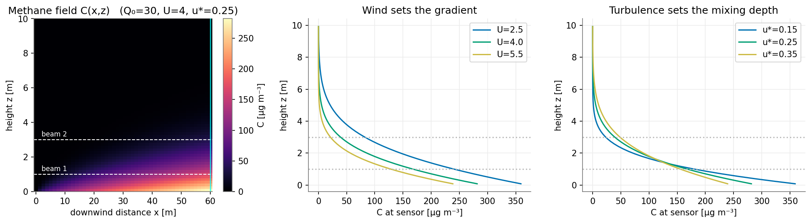
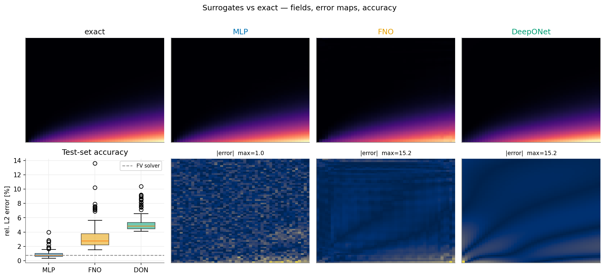
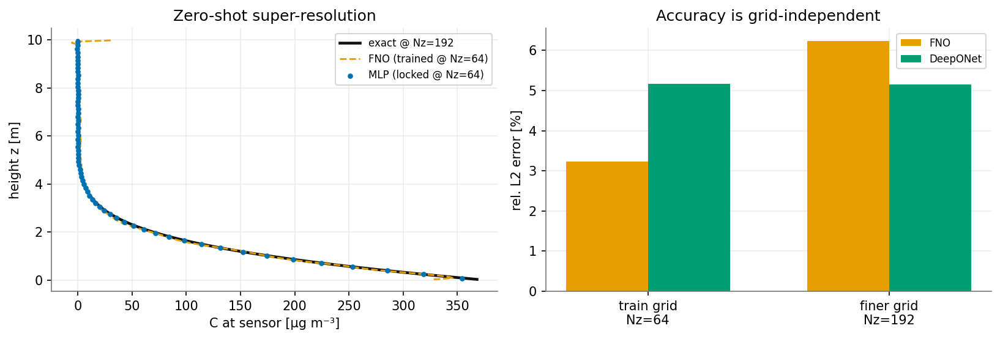
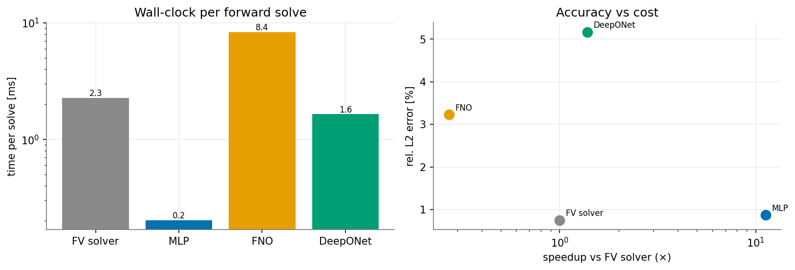
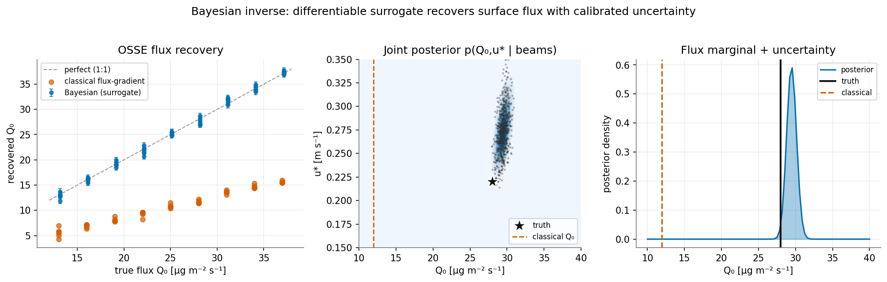

# AI-native numerical methods for methane-flux inversion

**Learned surrogates and a differentiable Bayesian inverse problem, built around a real atmospheric
transport PDE.**

Rice paddies are a major source of atmospheric methane. To measure how much a field emits,
experimentalists shine an open-path laser across it and read a path-averaged concentration at two
heights; turning those readings into a **surface flux** is an inverse problem sitting on top of a
transport **PDE**. This repository builds that whole pipeline end-to-end and uses it as a compact,
honest testbed for putting machine learning *inside and around* a numerical solver: neural-operator
surrogates, physics-constrained training, uncertainty quantification, and a **differentiable
surrogate-in-the-loop Bayesian inversion**.

Everything runs on a laptop CPU in a few minutes. The full tutorial is one self-contained,
heavily-annotated notebook: **[`notebooks/methane_flux_ai_tutorial.ipynb`](notebooks/methane_flux_ai_tutorial.ipynb)**.

---

## What this demonstrates

| Theme | In this repo |
|---|---|
| **Neural operators** | A Fourier Neural Operator (FNO) and a DeepONet learn the PDE solution operator; both shown to be **discretization-invariant** (train at Nz=64, deploy at Nz=192 with no retraining). |
| **ML that replaces a solver** | Surrogates trained against the exact solution, benchmarked on accuracy **and wall-clock cost** against a conservative implicit finite-volume solver. |
| **PDE-constrained learning** | Mass conservation (∫U·C dz = Q₀·x) enforced as a soft penalty vs. a hard architectural constraint. |
| **Differentiable simulation / inverse design** | The differentiable surrogate is used as the forward operator in a gradient-based (MALA) Bayesian inversion. |
| **Uncertainty quantification / Bayesian methods** | A deep ensemble (calibrated against ground truth) and a full posterior over the unknown flux, with credible intervals. |
| **Correctness & evaluation** | The solver is validated against a closed-form solution and shown to converge under grid refinement; a `pytest` suite checks the physics. |

The physics is a faithful (deliberately simplified) version of the forward model in an ongoing
LES-based methane data-assimilation project. The companion derivation document walks through every
equation from the 3-D advection–diffusion equation down to the finite-volume scheme.

---

## The problem in one figure

Methane emitted at the ground is advected downwind and mixed upward by turbulence. Wind speed sets
the vertical gradient; friction velocity sets the mixing depth. The two dashed lines are the laser
beams; the inverse problem is to recover the surface flux Q₀ from what they read.



---

## Key results

**Surrogates vs. the exact solution.** All three learned models reproduce the field; the structure-free
MLP is actually the most accurate here (**0.87%** mean relative L2, matching the finite-volume solver's
own **0.75%** discretization error) — an honest lesson that inductive bias must be *earned*, not
assumed, on a low-dimensional map.



**Discretization invariance (the operators' real payoff).** Trained at Nz=64 and evaluated, with no
retraining, on a 3× finer grid: the DeepONet is resolution-exact (5.2% → 5.2%) and the FNO transfers
with a mild cost (3.2% → 6.2%). The MLP is welded to its training grid and cannot do this at all.



**Accuracy vs. cost.** The whole point of a surrogate is to sit inside an outer loop that calls it
thousands of times. The MLP is the sweet spot here: ~11× faster than the solver per single solve, and
**>200× faster batched** — exactly the access pattern an MCMC sampler needs.



**The payoff — a differentiable Bayesian inverse problem.** In an Observing-System Simulation
Experiment, the classical flux-gradient estimator is badly **biased** (recovers ~43% of the true
flux), while the surrogate-based Bayesian inversion is **unbiased** with a **calibrated** posterior
(±1σ covers the truth ~67% of the time). The joint posterior also exposes a Q₀–u\* identifiability
ridge that a point estimate hides.



Additional results in the notebook: training curves, the physics-constrained models (the hard mass
constraint is exact and even *improves* accuracy), and the deep-ensemble calibration study.

---

## Repository layout

```
ai-native-methane-flux/
├── methane_ai/
│   └── forward.py          # the physics: exact solution + finite-volume solver + sampling
├── notebooks/
│   └── methane_flux_ai_tutorial.ipynb   # the full annotated tutorial (start here)
├── tests/
│   └── test_forward.py     # validates the solver vs exact, mass conservation, convergence
├── figures/                # figures generated by the notebook
├── requirements.txt
└── LICENSE
```

## Running it

```bash
pip install -r requirements.txt

# run the physics test-suite
pytest -q

# open the tutorial
jupyter notebook notebooks/methane_flux_ai_tutorial.ipynb
```

The notebook is paired (via [jupytext](https://jupytext.readthedocs.io/)) with a plain-text
`.py` version for clean version control; either can be run.

## The physics, briefly

After Reynolds averaging and a K-theory closure, methane transport over a homogeneous field reduces to
a 1-D advection–diffusion "master equation" in which downwind distance plays the role of time:

$$ U\,\partial_x C = \partial_z\!\left(K\,\partial_z C\right), \qquad -K\,\partial_z C\big|_{z=0} = Q_0. $$

For constant K this has a closed-form (erfc) solution used as ground truth; the general
height-varying-K case has no closed form and is what the finite-volume solver — and, ultimately, the
neural surrogate — stands in for.

## Honest notes

- On this smooth, low-dimensional (3-parameter) map the MLP beats the neural operators on accuracy.
  The operators are included because they buy **grid-independence** and **mesh-free evaluation**, not
  because they win every metric — choosing the right tool for the structure of the problem is the point.
- The FNO is slower than the solver *on CPU* (it is FFT-heavy); its advantage is batched GPU
  throughput plus discretization invariance.
- The classical flux-gradient bias shown here is specific to this fetch and beam geometry; its size is
  exactly the kind of "flux-method error budget" the real campaign exists to quantify.

## License

MIT — see [LICENSE](LICENSE).
